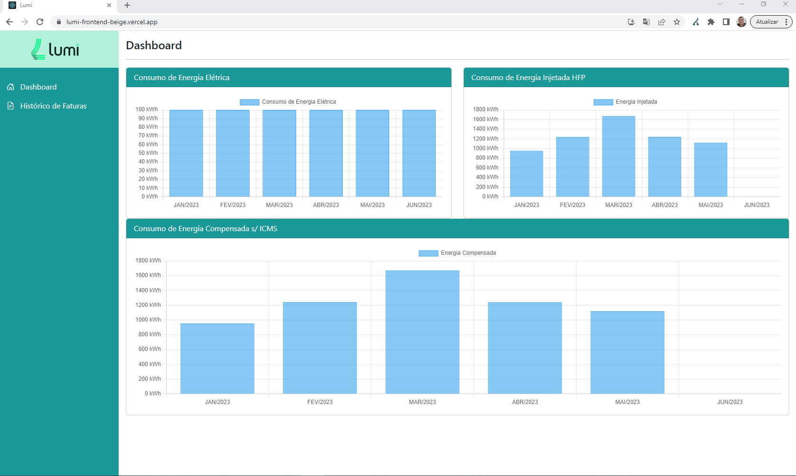
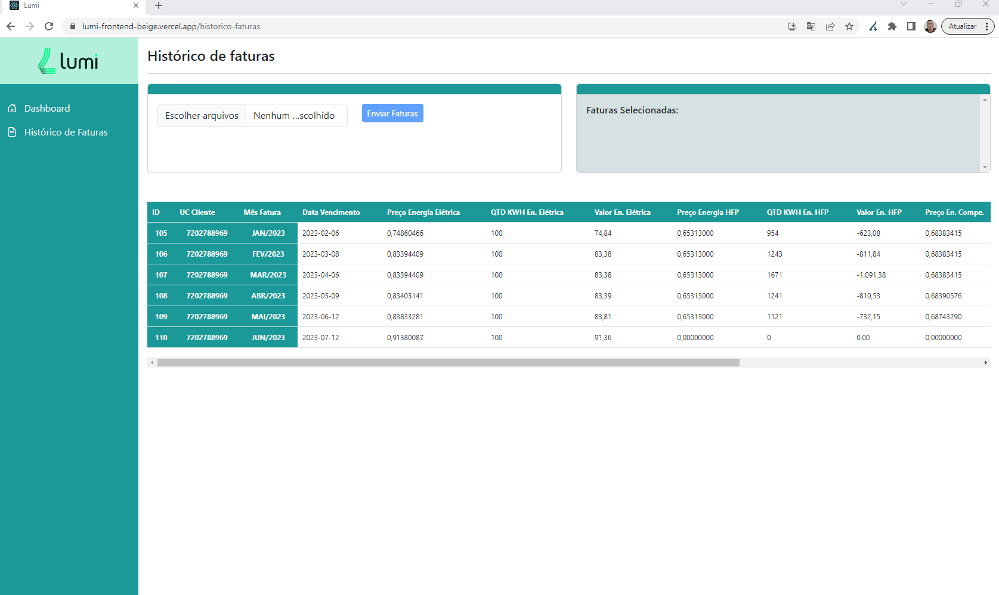

# lumi-frontend
Desafio da empresa Lumi (Frontend)

O desafio do frontend foi construido em React JS, usando componetização e consumo de dados vindo da api REST.

Primeiramente ele está hospedado no seguinte dominio:
### https://lumi-frontend-beige.vercel.app/

Ele tem como funcionalidade nas seguintes páginas:

- Dashboard: onde exibe um conjunto de gráficos em barras que demonstra a quantidade em KWH de consumo que existe na fatura dividido pelos meses de consumo.

- Histórico de faturas: onde exibe uma lista de faturas em uma tabela organizadas por UC e mes de referencia do consumo com os dados completo de consumo.

Aqui abaixo alguns prints das telas:

 - Dashboard

 - Histórico de Faturas

 

 ### - Tive problemas em hospedar arquivos tanto no S3 da aws quanto no CYCLIC e na Railway, não mostrará os dados em tempo de execução e sim ja dados salvos no banco, a idéia é era no historico de faturas eu pegar as faturas fazer o upload para uma pasta fazer essa leitura e salvar no banco de dados em seguida mostrar no projeto os seus dados.

 ### - Posso mostrar localmente isso funcionando.